# Architecture – ProjectW System Overview

**작성 목적:** ProjectW(개발 코드명) / **외행성재척지원실 3과**의 전반적인 시스템 구조를 한눈에 파악하기 위한 구현·문서 통합 개요이다.

## Git 동기화 메타데이터

<!-- arch-sync:begin -->
| 항목 | 값 |
|------|-----|
| **동기화 모드** | `index (pre-commit / manual)` |
| **동기화 시각 (UTC)** | `2026-06-06T15:34:27Z` |
| **기준 커밋 (전체 SHA)** | `4ab3039207a5cdb70ee0c3fafb6bdd4c35d18569` |
| **기준 커밋 (단축)** | `4ab3039` |
| **브랜치** | `ai-integration` |
| **추적 경로 지문** | `sha256:2dd58fa5a0db82e0bf1b7107924642f303a2f2fbdfa1b3905287d53cfd12bca3` |
| **추적 경로** | `Assets/Specification/`<br>`Assets/Scripts/`<br>`Assets/Tests/`<br>`Assets/Editor/`<br>`Assets/Resources/CaseReviewData/` |

> 지문은 Git 인덱스(`git ls-files -s`)에 등록된 추적 경로 파일 목록·blob 해시의 SHA-256이다.  
> 자기참조를 피하기 위해 본 Architecture 문서 자체는 지문 계산에서 제외한다.
> `pre-commit` 훅 또는 `python tools/sync_architecture_doc.py` 실행 시 갱신된다. CI는 `--check`로 불일치를 검출한다.
<!-- arch-sync:end -->

**자동 추적**

| 방법 | 설명 |
|------|------|
| 로컬 훅 | `sh tools/install_githooks.sh` → `pre-commit`이 지문 갱신, `post-commit`이 확정 SHA 반영 |
| 수동 | `python tools/sync_architecture_doc.py` |
| CI | PR 시 `architecture-doc-sync` 워크플로가 `--check`로 지문 불일치 검출 |

**관련 문서**

| 역할 | 경로 |
|------|------|
| AI·문서 우선순위 | `Project_W – System Index (AI Entry Point).md` |
| 인게임 규칙 SSOT | `Ingame/SSOT – Ingame.md` |
| 업무 규칙 SSOT | `Ingame/SSOT – Work.md` |
| 스크립트·연출 SSOT | `Ingame/SSOT – Script Presentation.md` |
| 아웃게임 규칙 SSOT | `SSOT – Outgame.md` |
| 워크플로·메타 | `SSOT – Workflow Confluence × Unity × GitHub.md`, `SSOT – Metadata.md` |

> **동기화 주의 (2026-06 기준):** 루트 `README.md`·빌드 설정·CI 게이트에 남아 있는 Routine Observation MVP·Outgame 씬 참조는 **현재 `Assets/Scripts` 구현과 일치하지 않는다.** 본 문서의 「구현 현황」 절을 기준으로 판단한다.

---

## 1. 프로젝트 정체성

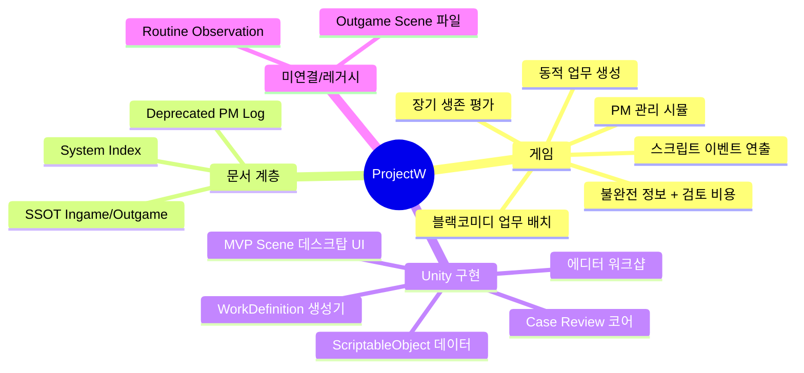

| 항목 | 내용 |
|------|------|
| **개발 코드명** | Project_W / ProjectW |
| **작업 제목** | 외행성재척지원실 3과 |
| **장르·핵심** | 중간관리자 시점의 업무 배치·서류 검토·덱 기반 개체 행동·피드백 루프 |
| **플레이어 목표** | AI 제안과 인간 검토 사이에서 비용을 조절하며, AI 대체 불가한 관리 가치를 증명 |
| **장기 구조** | 일일 업무 → 주간 감사 → 월별 평가 → 분기 평가 → 연말 정산 |
| **폐기된 방향** | 순수 관찰형 자동 서사, 검토 비용 없는 완전 정보 UI, AI 제안 무조건 정답 처리 |

---

## 2. 문서·구현·Git 3층 구조

AI·협업 시 **판단 순서는 고정**이다 (System Index 기준).

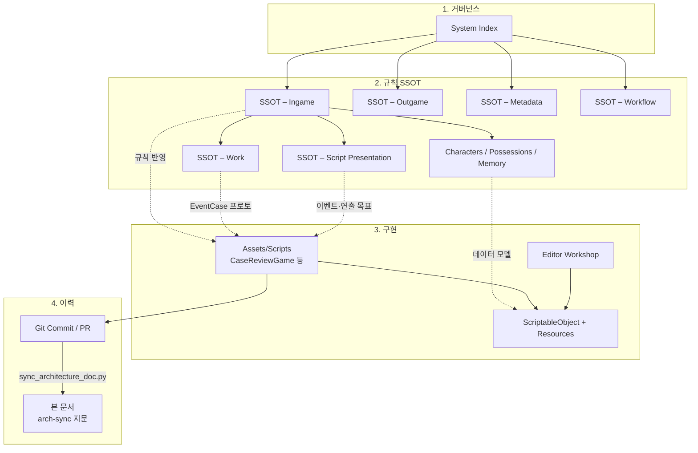

**Sync Rule:** 문서↔구현 불일치 시 → SSOT 수정 여부 확인 → 미갱신이면 SSOT 먼저 → Unity 반영 → 커밋 메시지에 SSOT 경로 명시.

**PM Log:** 판단 순서에서 **제외**(Deprecated). 유효 결정은 SSOT·Ingame `Decision Ledger`로 흡수한다.

---

## 3. Unity 프로젝트 물리 구조

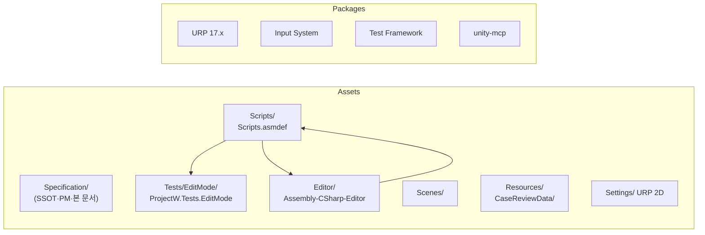

| 폴더 | 상태 | 역할 |
|------|------|------|
| `Assets/Specification/` | 활성 | 규칙·PM·아키텍처 문서 |
| `Assets/Scripts/IngameCore/CaseReview/` | **유일한 런타임 코드** | 순수 게임 로직 + MVP Scene UGUI 드라이버 + SO 정의 + 업무 생성기 + 시나리오 데이터 |
| `Assets/Editor/` | 활성 | 캐릭터 데이터 워크샵, 에디터 리프레시 |
| `Assets/Tests/EditMode/` | 활성 | Case Review 코어 단위 테스트 |
| `Assets/Resources/CaseReviewData/Samples/` | 활성 | 캐릭터/업무 샘플 SO 에셋 (로드 코드는 아직 없음) |
| `Assets/Resources/CaseReviewData/Scenarios/` | 활성 | 시나리오 이벤트·텍스트·렌더 샘플 SO 에셋 |
| `Assets/Scenes/MVP Scene.unity` | 존재 | 빌드 포함, `CaseReviewMvpSceneController` 런타임 UGUI 드라이버로 MVP 일일 루프 플레이 |
| `Assets/Scenes/CharacterDataWorkshop.unity` | 존재 | 데이터 제작 전용, 빌드 미포함 |
| `Assets/Scenes/ScenarioDataWorkshop.unity` | 존재 | 시나리오 데이터 제작 전용, 빌드 미포함 |
| `Assets/Scenes/Outgame Scene.unity` | **누락** | 빌드 설정에만 참조 (깨진 참조) |
| `Assets/Data`, `Prefabs`, `Materials` 등 | 빈 폴더 | 예약 |

---

## 4. 어셈블리·네임스페이스

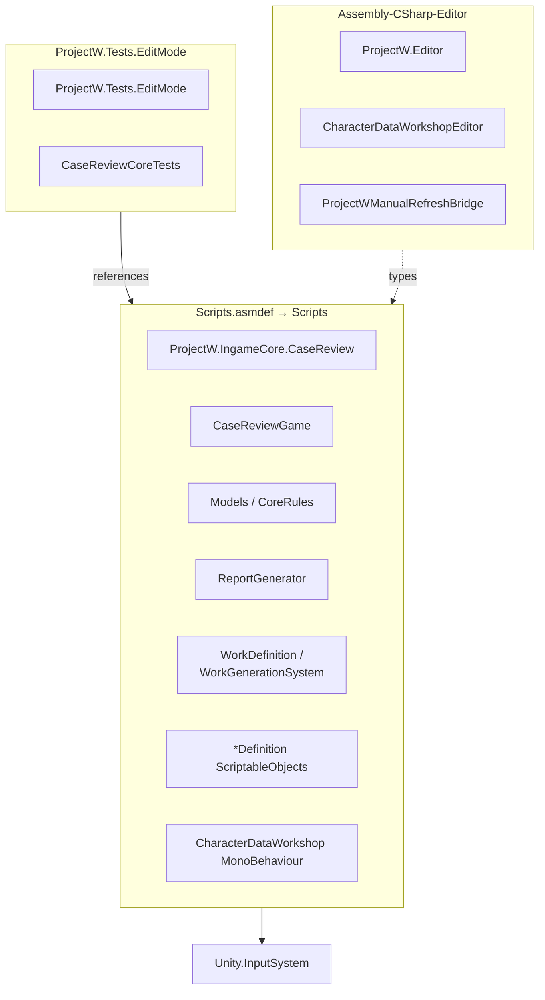

| 어셈블리 | 플랫폼 | 포함 |
|----------|--------|------|
| `Scripts` | Player + Editor | CaseReview 전 모듈, WorkDefinition, WorkGenerationSystem |
| `ProjectW.Tests.EditMode` | Editor only | `CaseReviewCoreTests.cs` |
| `Assembly-CSharp-Editor` | Editor | 워크샵·메뉴·리프레시 |

**설계 포인트:** `CaseReviewGame`은 `UnityEngine`에 의존하지 않는 **순수 C# 로직**이다. EditMode 테스트에서 Unity 런타임 없이 결정론·리플레이를 검증할 수 있다.

---

## 5. 인게임 설계 (SSOT) vs 구현 (Case Review)

### 5.1 SSOT 장기 루프

최신 Ingame SSOT는 하루 단위 업무를 상위 평가 주기와 연결한다.

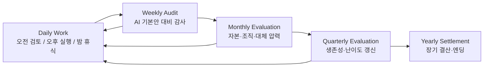

세션 기본 범위는 6개월~2년이다. 2년 뒤 AI 도래는 피할 수 없는 종료 조건이며, 그 전까지 누적 평가·자본 상태·조직 상태·AI 대체 압력이 생존/대체 판단을 만든다.

### 5.2 SSOT 일일 루프

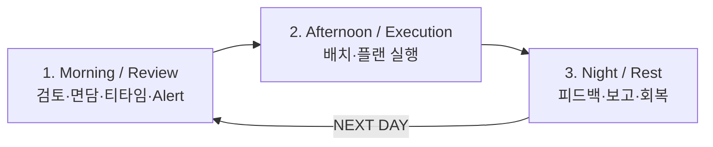

기존 `Morning Draft → Review & Planning → Assignment → Execution → Feedback` 구조는 위 3슬롯 구조 안으로 흡수된다.

### 5.3 구현 슬롯·명령 매핑

`CaseReviewGame`은 텍스트 명령 REPL로 위 루프를 프로토타이핑한다.

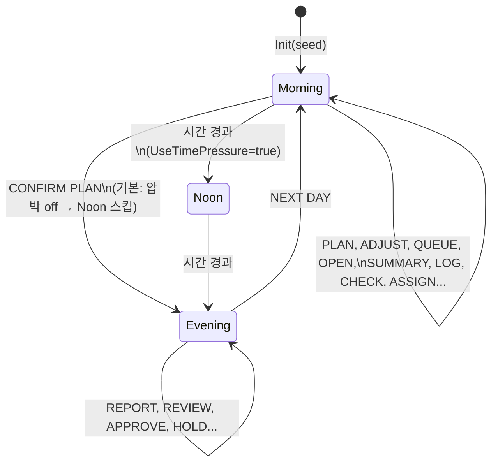

| `Slot` | 기본 시간(초) | 비고 |
|--------|---------------|------|
| `Morning` | 90 | 아침 카드·플랜·배치 |
| `Noon` | 210 | `UseTimePressure`일 때만 |
| `Evening` | 120 | 보고·피드백·일 종료 |

**주요 API**

| 메서드 | 역할 |
|--------|------|
| `Init(config, seed)` | 시드·인력·큐·아침 플랜·카드 |
| `Dispatch(state, command)` | 플레이어 명령 처리 |
| `Advance(state, deltaSec)` | 시간 진행·슬롯 전환 |
| `Snapshot` / `Restore` | JSON 직렬화 상태 저장 |
| `Replay(seed, commands)` | 결정론 리플레이 검증 |

**대표 명령:** `HELP`, `STATUS`, `PLAN`, `CONFIRM PLAN`, `ADJUST`, `QUEUE`, `OPEN`, `SUMMARY`, `LOG`, `CHECK`, `ASSIGN`, `REDIRECT`, `REPORT`, `REVIEW`, `APPROVE`, `HOLD`, `NEXT DAY`

### 5.4 진실 vs 표면 (정보 비대칭)

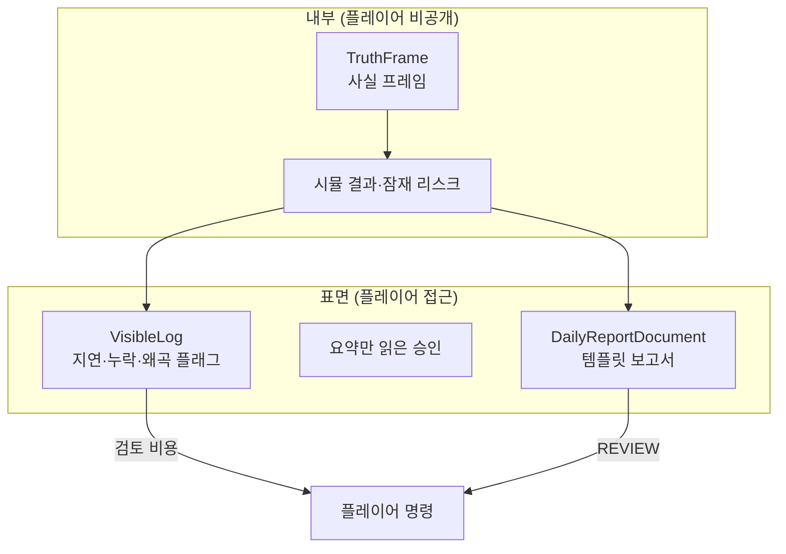

검토 행동마다 `ReviewCostEntry`(시간·자원·집중·신뢰·AI 대체 압력)가 기록된다. SSOT 원칙: **전부 검토하면 늦게 실패, 전혀 검토하면 누적 실패.**

### 5.5 보스 이벤트·감사·스크립트 파트

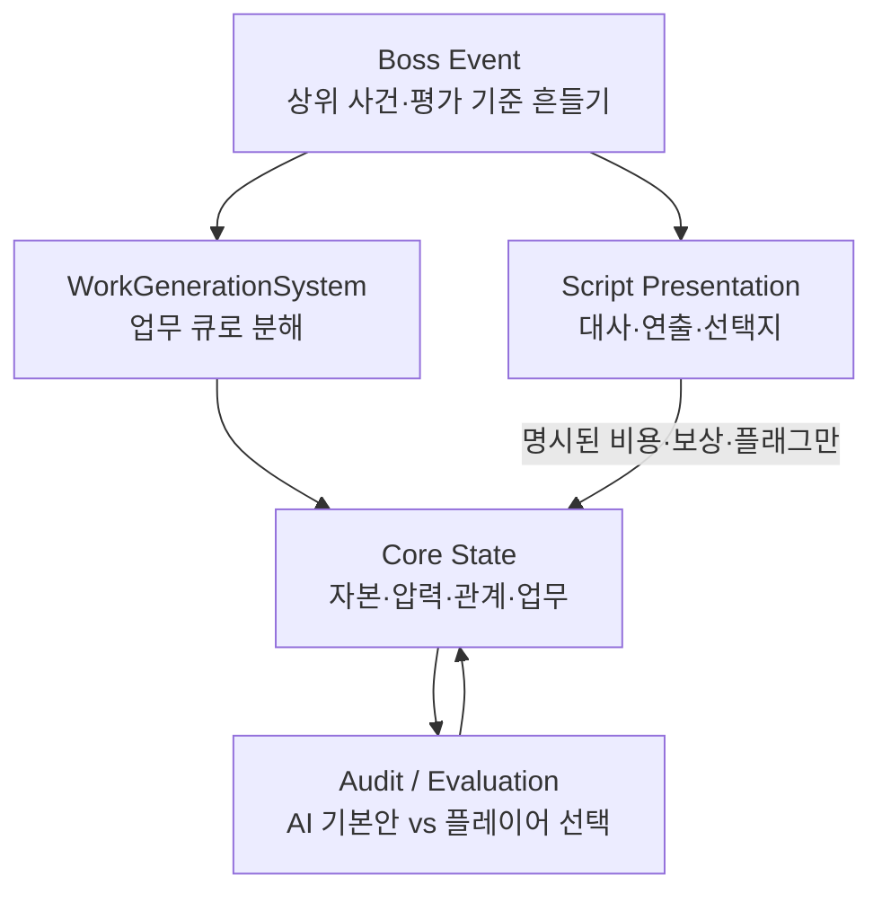

보스 이벤트는 단순 랜덤 업무가 아니라 자본, 조직 상태, 업무 큐, 평가 기준, AI 대체 압력에 영향을 주는 상위 사건이다. 업무 생성기는 이를 `boss`, `audit`, `ai`, `emergency`, `morale`, `legal` 태그 업무로 분해할 수 있다.

감사 시스템은 플레이어 선택을 MVP AI 기본안과 비교한다. MVP AI는 복잡한 인격형 의사결정자가 아니라 빈 슬롯 보충과 기존 플랜 유지에 집중하는 기준선이다.

스크립트 파트는 대사, 화자, 표정, 중앙 이미지, 포커스, 선택지, 비용을 표현한다. 코어 상태를 읽을 수 있지만 상태 변경은 선택지 효과 또는 종료 효과에 명시된 비용·보상·플래그로만 적용한다. 현재 구현은 `ScenarioEventDefinition`, `ScenarioScriptLine`, `LocalizedTextTable` 데이터 에셋, 조회 인터페이스, `LocalizedTextCsv` CSV 변환, `LocalizedTextTableEditor` 텍스트 import/export, `ScenarioDataWorkshop` 제작 씬/에디터를 포함한다. `CaseReviewMvpSceneController`에는 Dev Tools에서 명시적으로 실행하는 샘플 시나리오 뷰어가 있으나, SSOT가 요구하는 조건 기반 큐잉/스케줄러 런타임은 아직 없다.

### 5.6 업무 시스템 (SSOT – Work) vs `EventCase`

2026-06-03 **Work Data Direction**(`SSOT – Ingame.md` §15)에 따라 업무 규칙이 `SSOT – Work.md`로 분리되었다.

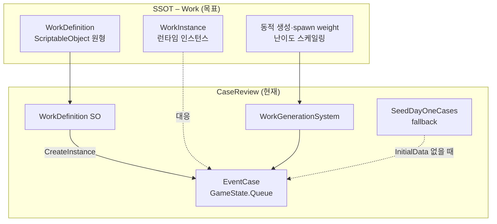

| SSOT 개념 | 현재 구현 | 상태 |
|-----------|-----------|------|
| `WorkInstance` | `EventCase` | 프로토타입 대응 |
| `Urgency`, `Severity` | 동명 필드 | 부분 |
| 업무량 | `PhysicalCost`, `MentalCost` | 초기 |
| 잠복 리스크 | `LatentRisk` | 있음 |
| 요구 적성 | `RequiredAptitudes` | 있음 |
| 카드/퍽 태그 | `PerkTags`, `PerkInteractionInfo` | 초기 |
| `WorkDefinition` SO | `WorkDefinition` | 초기 구현 |
| 동적 생성 풀·가중치 | `WorkGenerationSystem`, `WorkSpawnProfile` | 초기 구현 |
| 동시작업 가능수 | `ConcurrentLimit`, `ConcurrentSlotCost` | 데이터 필드 구현, 실행 규칙 부분 |

상세 매핑·금지 규칙: `Ingame/SSOT – Work.md` §11–12.

### 5.7 Decision Ledger (Ingame SSOT)

과거 PM Log에서 흡수된 **규칙 수준** 결정만 `SSOT – Ingame.md` §15에 보존한다. 일정·회고·증빙은 권위 범위가 아니다.

| 결정 앵커 | 요약 |
|-----------|------|
| Current Direction | Papers Please + 덱빌딩형 PM 시뮬, 검토 비용·AI 대체 압력 |
| Work Data Direction | 동적 업무 생성, 태그·적성·리스크, `SSOT – Work` 참조 |
| Character Data Direction | Base/Runtime SO 분리, 카드·퍽·관계·기억 |
| Clone and Growth | 폐기/재생성은 유료, 성장은 카드·기억 축적 |
| Long Loop Direction | 일일 업무, 주간 감사, 월별·분기별 평가, 연말 정산 |
| Script Presentation Direction | 코어 상태를 읽는 대사·연출·선택지, 명시된 효과만 상태 반영 |

### 5.8 MVP Scene Runtime UI

현재 MVP Scene의 플레이 가능 UI는 `CaseReviewMvpSceneController`가 런타임에 생성하는 UGUI 데스크탑이다.

| 영역 | 현재 구현 |
|------|-----------|
| 데스크탑 진입 | 좌상단 정렬 1:1 shortcut: `Current Work`, `Today Plan`, `Daily Report`, `Characters`, `Dev Tools` |
| 창 구조 | `CurrentWorkDashboard`, `TodayWorkPlan`, `DailyReport`, `CharacterProfiling`, `DevTools` 목적 중심 창 |
| Current Work | 업무 현황과 SYS DIAG, 사람/업무 gauge, 최근 로그를 함께 표시 |
| Daily Report | 최신 일일 리포트 summary 팝업, 리포트가 없으면 empty state 표시 |
| Dev Tools | 샘플 시나리오 재생과 향후 개발 전용 도구 진입점 |
| 창 조작 | 드래그 이동, 세션 내 위치 기억, 리사이즈, 최소 크기, 기본 세로 스크롤 |
| 가독성 기준 | MVP UI 텍스트 최소 30 px, 이에 맞춘 버튼·슬롯·카드·로그 높이 확장 |
| Phase 처리 | desktop shortcut은 phase에 따라 사라지지 않으며, 부적합 phase에서는 최신 정보를 read-only로 표시 |
| Desktop Actions | 우하단 고정 액션 버튼: Morning에는 `STAMP APPROVED / Start Work`, Evening에는 `NEXT MORNING / Advance Day` 활성화 |
| 업무 배치 | `TodayWorkPlan`의 슬롯을 선택하면 창 내부가 아니라 별도 floating panel이 오른쪽에 열리고 캐릭터 선택 리스트 표시 |
| Floating Wing | owner 창 이동/리사이즈 시 `WindowLayoutState` 기준으로 다시 계산되어 따라붙음 |
| 캐릭터 선택 행 | 얼굴 placeholder, 이름/id, load/fatigue/trust 상태를 표시하고 선택 불가 캐릭터는 floating picker 안에서 dim 처리 |
| Character Profiling | 상단 ID/이름 탭 그리드, 1단 얼굴+캐릭터 상태, 2단 Today Card 목록의 세로 구조 |
| 실행 피드백 | `CONFIRM PLAN` 후 worker hand reveal과 used-card highlight를 보여주는 work performance overlay |
| 상태 경계 | `CaseReviewGame.Dispatch`와 명시적 assignment sync 경계를 유지 |

---

## 6. Case Review 모듈 상세

### 6.1 클래스 역할 맵

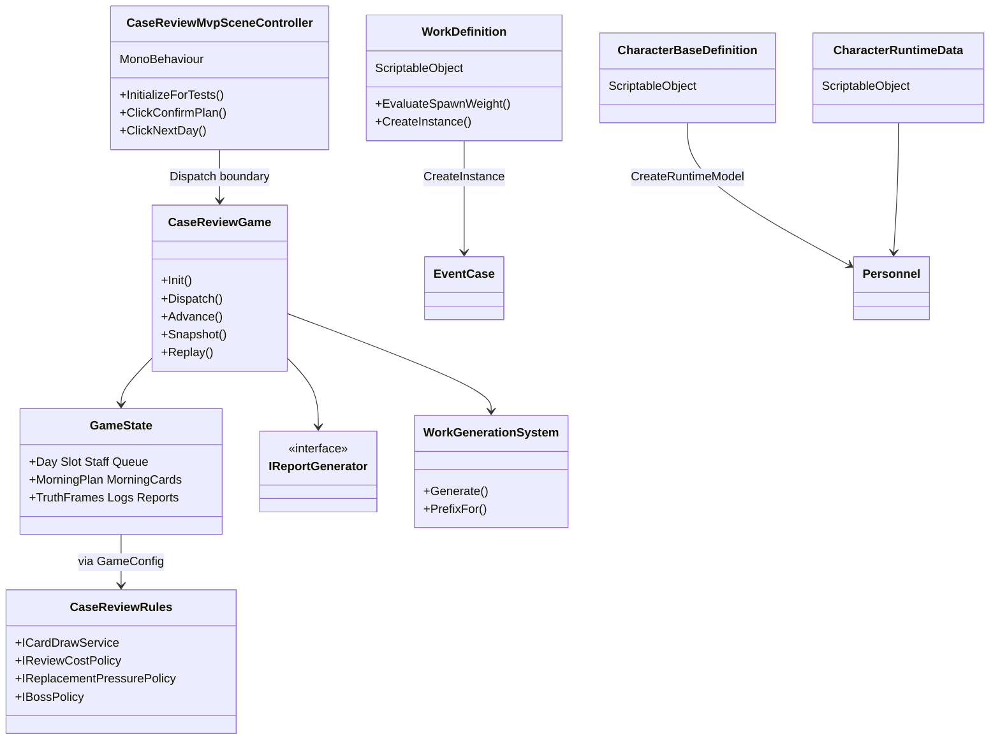

| 파일 | 책임 |
|------|------|
| `CaseReviewGame.cs` | 유일한 게임 엔진 진입점, 명령·틱·일 진행 |
| `CaseReviewMvpSceneController.cs` | MVP Scene 런타임 UGUI 데스크탑, 목적 중심 창, assignment picker, work performance overlay |
| `Models.cs` | `GameState`, `GameConfig`, `EventCase`, `Personnel`, DTO |
| `CoreRules.cs` | `CaseReviewRules` + 기본 정책 구현 |
| `ReportGenerator.cs` | 일일·개별 보고서 텍스트 생성 |
| `WorkDefinition.cs` | 업무 원형 SO, spawn weight 평가, `EventCase` 생성 |
| `WorkGenerationSystem.cs` | `WorkDefinition` 후보 풀의 결정론적 가중치 선택 |
| `CharacterDataAssets.cs` | SO 인터페이스, 관계·기억 레코드, 데이터 변경 인터페이스 |
| `CharacterBaseDefinition.cs` | 시작 덱·퍼크가 있는 베이스 캐릭터 |
| `CharacterRuntimeData.cs` | 진행 상태·관계·기억, 외부 주입용 변경 함수 |
| `ActionCardDefinition.cs` / `PerkDefinition.cs` | 카드·퍼크 SO |
| `RenderResourceDefinition.cs` | UI/연출 메타 (로직 미연결) |
| `CharacterDataWorkshop.cs` | 씬용 `MonoBehaviour` (출력 폴더만) |
| `ScenarioDataWorkshop.cs` | 시나리오 제작 씬용 `MonoBehaviour` |
| `LocalizedTextCsv.cs` | 로컬라이즈드 텍스트 CSV 변환 |
| `LocalizedTextTableEditor.cs` | 텍스트 테이블 CSV import/export 인스펙터 |

### 6.2 확장점 (플러그 정책)

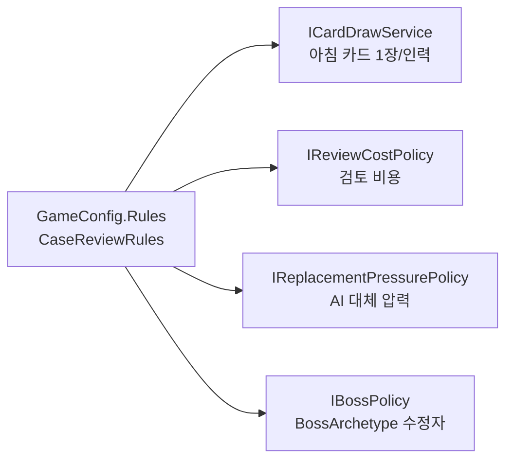

기본 구현은 `DefaultCardDrawService`, `DefaultReviewCostPolicy` 등이 `CoreRules.cs`에 동봉된다. 테스트에서 `ConfigRules_CanPlugCustomCardDrawService`로 교체 가능함을 검증한다.

---

## 7. 캐릭터·콘텐츠 데이터 파이프라인

### 7.1 Authoring → Runtime

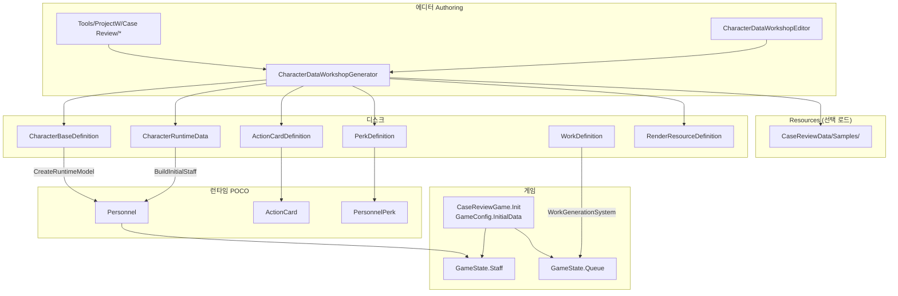

### 7.2 샘플 콘텐츠 인벤토리

`Assets/Resources/CaseReviewData/Samples/` (에디터 메뉴로 생성·갱신 가능)

`Assets/Resources/CaseReviewData/Scenarios/` (시나리오 워크샵 메뉴로 생성·갱신 가능)

| 종류 | 샘플 (접두) |
|------|-------------|
| Base 캐릭터 | `Base_CautiousPlanner`, `Base_QuietAuditor`, `Base_ShortcutOperator` |
| Runtime 캐릭터 | `Runtime_*` (위 3종 대응) |
| 행동 카드 | `Card_DamageControl`, `Card_Overdocument`, `Card_ShortcutPatch`, `Card_SilentAudit` |
| 퍼크 | `Perk_PanicImproviser`, `Perk_PatternAuditor`, `Perk_ProcedureLoyalist` |
| 렌더 | `RR_CautiousPlanner`, `RR_QuietAuditor`, `RR_ShortcutOperator` |

**현재 갭:** 코드베이스에 `Resources.Load` 호출이 없다. `InitialData == null`이면 `SeedStaff()`와 `SeedDayOneCases()` 하드코딩 시드가 사용된다. `CaseReviewSeedData.WorkDefinitions`가 주어지면 `DefaultWorkGenerationService`가 초기 큐를 생성한다. 런타임 UI 연결 시 `Resources.LoadAll<CharacterRuntimeData>`와 `Resources.LoadAll<WorkDefinition>` 또는 Addressables가 자연스러운 다음 단계다.

### 7.3 데이터 변경 계약

캐릭터 런타임 데이터는 외부 시스템이 직접 컬렉션이나 필드를 수정하지 않는다.
`CharacterRuntimeData`는 `ICharacterMutationTarget`을 구현하며, 성장·사건·면담·클론 처리·AI 추천 시스템은 이 인터페이스를 통해 변화를 주입한다.

| 변경군 | 인터페이스 함수 |
|--------|----------------|
| 카드 | `AddCard`, `RemoveCard` |
| 퍽 | `AddPerk`, `RemovePerk` |
| 특성 샘플 | `AddTraitSample`, `RemoveTraitSample`, `AdjustTraitSampleStrength` |
| 기억 | `AddMemoryRecord`, `RemoveMemory`, `SetMemoryStat`, `AdjustMemoryStat` |
| 관계 | `SetRelationshipStat`, `AdjustRelationshipStat`, `RemoveRelationship` |
| 운영 상태 | `SetStat`, `AdjustStat`, `GetStat` |

규칙:

- 읽기용 프로퍼티는 `IReadOnlyList`로 노출한다.
- 쓰기는 인터페이스에 선언된 함수로만 수행한다.
- 변경 함수는 `CharacterMutationResult`를 반환한다.
- 수치 함수는 내부에서 유효 범위를 보정한다.
- 새 데이터 군을 만들 때도 같은 패턴으로 읽기 인터페이스와 변경 인터페이스를 분리한다.

### 7.4 워크샵 씬·메뉴

| 진입 | 경로 |
|------|------|
| 씬 | `Assets/Scenes/CharacterDataWorkshop.unity` |
| 시나리오 제작 씬 | `Assets/Scenes/ScenarioDataWorkshop.unity` |
| 메뉴 | `Tools/ProjectW/Case Review/Open Character Data Workshop Scene` |
| 시나리오 텍스트 CSV | `Tools/ProjectW/Case Review/Export Scenario Text CSV` |
| 샘플 일괄 생성 | `Tools/ProjectW/Case Review/Create or Refresh Sample Data` |
| 강제 리프레시 | `Tools/ProjectW/Refresh/Force Refresh` (`Ctrl+Shift+R`) |

---

## 8. 테스트·CI·품질

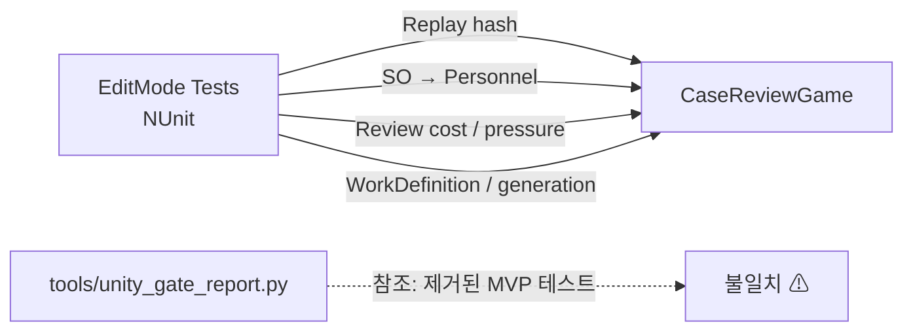

| 테스트 | 검증 주제 |
|--------|-----------|
| `Replay_WithSameSeedAndTape_*` | 결정론 리플레이 |
| `Init_DrawsOneMorningCard*` | 아침 카드 |
| `ConfigRules_CanPlugCustomCardDrawService` | 정책 주입 |
| `CharacterBaseDefinition_*` / `DataDefinitions_*` | SO → 런타임 모델·렌더 참조 |
| `CharacterRuntimeData_StoresRelationships*` | 관계 저장 |
| `InitialData_CanSeedStaff*` | `InitialData` 시드 |
| `ReviewActions_RecordReviewCostEntries` | 검토 비용 |
| `ConfirmingUnadjustedAiPlan_*` | AI 대체 압력 |
| `SummaryOnlyApprove_*` | 요약만 승인 리스크 |
| `EquipLog_IsUnavailable*` | 로그 가시성·지연 |
| `RedirectBudget_*` | 리다이렉트 예산 |
| `ConfirmPlan_*` / `Report_*` / `EventReports_*` | 일 운영·보고 루프 |
| `HighRetentionRisk_*` | 이탈·채용 |
| `MorningPlan_CanBeAdjusted*` | 플랜 조정 |
| `WorkDefinition_CreatesRuntimeEventCase` | 업무 SO → `EventCase` 변환 |
| `WorkGeneration_UsesDifficultyAndConditionWeights` | 난이도·조건 기반 spawn weight |
| `InitialData_CanGenerateQueueFromWorkDefinitions` | 초기 데이터의 업무 정의 기반 큐 생성 |

PlayMode 테스트는 없다.

---

## 9. 씬·런타임 진입점 현황

```mermaid
flowchart TB
  subgraph Implemented["구현됨"]
    INIT["CaseReviewGame.Init"]
    DISP["Dispatch / Advance"]
    UI["CaseReviewMvpSceneController\nruntime UGUI desktop"]
    GEN["WorkDefinition /\nWorkGenerationSystem"]
    TEST["EditMode Tests"]
  end
  subgraph SceneRuntime["씬 진입점"]
    MVP["MVP Scene.unity\nCase Review MVP"]
    WORK["CharacterDataWorkshop.unity"]
  end
  subgraph Broken["깨짐/레거시"]
    OUT["Outgame Scene.unity\n(빌드 index 0, 파일 없음)"]
    RO["README: RoutineObservationMvpSession"]
    REC["README: RuntimeErrorConsole"]
  end

  TEST --> INIT
  TEST --> GEN
  MVP --> UI
  UI --> INIT
  UI --> DISP
  WORK -->|SO 생성만| SO["ScriptableObjects"]
  OUT -.x|missing file| OUT
```

| 진입 유형 | 상태 |
|-----------|------|
| 게임 로직 | `CaseReviewGame` 정적 API |
| MVP Scene 플레이 | `CaseReviewMvpSceneController`가 런타임 UGUI 데스크탑으로 `CaseReviewGame` 일일 루프를 구동 |
| 업무 생성 | `WorkDefinition` + `WorkGenerationSystem` 초기 구현 |
| 플레이 가능 빌드 루프 | Morning plan → assignment → confirm → work performance overlay → Daily Report → next morning |
| 데이터 제작 | 워크샵 씬 + 에디터 메뉴 |
| `GameManager` / `Bootstrap` | 없음 |

---

## 10. 아웃게임·메타 (문서만 정의)

SSOT상 Outgame은 세션 간 인력·조직 이력·클론 베이·AI 대체 압력 추적 공간이다. **Unity C# 구현은 아직 없다.**

```mermaid
flowchart TB
  OUT_SSOT["SSOT – Outgame"]
  ING["Ingame Case Review"]
  OUT_SSOT -.->|영향: 덱·특성·압력| ING
  OUT_SCENE["Outgame Scene\n(빌드만 등록)"]
  OUT_SCENE -.x|파일 없음| OUT_SSOT
```

---

## 11. 협업·브랜치·도구

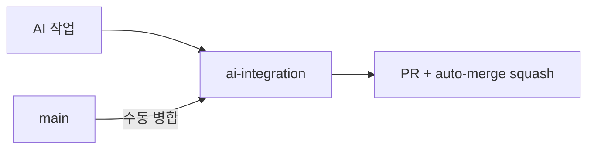

| 도구 | 용도 |
|------|------|
| Git `ai-integration` | AI 기본 통합 브랜치, PR auto-merge |
| `com.coplaydev.unity-mcp` | 에디터 자동화 (MCP) |
| URP 2D + Input System | 렌더·입력 인프라 (Case Review 미사용) |

---

## 12. 기술 부채·다음 연결 작업

| 항목 | 권장 조치 |
|------|-----------|
| `Outgame Scene.unity` 빌드 참조 | 씬 복구 또는 `EditorBuildSettings`에서 제거 |
| README Routine Observation | 제거·갱신 또는 코드 복원 결정 |
| `unity_gate_report.py` | `CaseReviewCoreTests`·현행 SSOT 기준으로 게이트 목록 수정 |
| WorkDefinition 샘플 에셋 | `Resources/CaseReviewData/Samples`에 업무 샘플 생성 |
| Boss/Audit 컨텍스트 | `WorkGenerationContext`에 보스 이벤트 압력·감사 평가 방향 추가 |
| Script Presentation 런타임 | MVP 명시 실행 뷰어 이후 조건 기반 시나리오 큐잉/스케줄러 구현 |
| ScenarioDataWorkshop 확장 | TSV/XLSX 직접 import, 일괄 key 검증, 미번역 텍스트 리포트 |
| `Resources.Load` 부트스트랩 | `GameConfig.InitialData`에 캐릭터·업무 샘플 SO 자동 연결 |
| MVP Scene | 대형 폰트/스크롤 기준에서 실제 기기별 레이아웃 QA와 PlayMode 테스트 추가 |
| `RenderResourceDefinition` | UI 레이어에서 `IRenderableData` 소비 |
| Outgame 시스템 | SSOT에 맞춘 별도 모듈·씬 설계 |
| Architecture doc 지문 | 추적 경로 변경 후 `sync_architecture_doc.py` 또는 훅 설치 |

---

## 13. 한 줄 요약

**ProjectW는 SSOT(Ingame·Work·Script Presentation·Characters)가 규칙의 중심이고, Unity 구현은 `CaseReview`의 `EventCase` 프로토타입·MVP Scene 런타임 데스크탑 UI·`WorkDefinition` 업무 생성기·캐릭터 SO 파이프라인·시나리오/로컬라이제이션 데이터 에셋·CSV 텍스트 편집 도구·워크샵·EditMode 테스트에 집중되어 있다. 장기 감사/평가 루프와 조건 기반 시나리오 큐잉은 SSOT에 정의됐으나 아직 확장 과제이며, Git 지문(`arch-sync`)으로 본 문서와 추적 경로의 동기화를 자동 검증한다.**

---

## 부록: 최근 설계 변경 요약 (2026-06)

| 날짜 | 변경 | 영향 |
|------|------|------|
| 2026-06-03 | 장기 코어 루프 확장 | Daily/Weekly/Monthly/Quarterly/Yearly 평가 구조 추가 |
| 2026-06-03 | 보스 이벤트·감사 평가 방향 | 보스 사건을 업무 생성과 평가 기준에 연결 |
| 2026-06-03 | `SSOT – Script Presentation.md` 신설 | 대사·연출·선택지·명시적 상태 변경 경계 정의 |
| 2026-06-03 | 시나리오 텍스트 CSV 도구 | 로컬라이즈드 텍스트 테이블을 CSV로 export/import |
| 2026-06-03 | `WorkDefinition` / `WorkGenerationSystem` | 업무 SO 원형과 결정론적 spawn weight 생성기 초기 구현 |
| 2026-06-03 | `SSOT – Work.md` 신설 | 업무 원형·인스턴스·동적 생성·태그 상호작용 규칙 분리 |
| 2026-06-03 | Ingame §15 Decision Ledger | PM Log 판단 권한 폐기, 핵심 결정 SSOT 흡수 |
| 2026-06-03 | System Index 판단 순서 정리 | PM Log → Deprecated, Git·구현 순서 명확화 |
| 2026-06-06 | MVP Scene 데스크탑 UI 3창 재구성 | Current Work, Today Plan, Character Profiling, Dev Tools 목적 중심 창과 데스크탑 shortcut 구조 |
| 2026-06-06 | MVP UI 접근성 기준 | 모든 런타임 UI 텍스트 최소 30 px, 창 기본 스크롤, drag/resize/위치 기억, assignment picker dim 처리 |
| 2026-06-03 | Character Data Workshop | SO 샘플·에디터 생성 파이프라인 |
| (이전) | `CaseReviewRules` | 카드 뽑기·검토 비용·대체 압력·보스 정책 플러그 |

*본 절은 수동 요약이다. Git 동기화 상태는 상단 `arch-sync` 블록을 따른다.*
