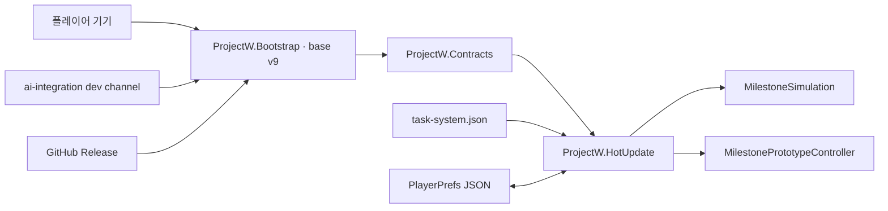

# ProjectW 게임 완성 구조도

## 문서 기준

- 기준일: 2026-08-31
- 기준 브랜치: `ai-integration`
- 게임 SSOT: `Assets/Specification/System/TaskSystem.md` v4.0
- 운영 SSOT: `Assets/Specification/Operation/HotUpdateAotSafety.md` v1.2
- 현재 base APK: v9
- 현재 프로토타입 완성도 추정: **78%**

이 문서는 사양이 아니라 구현·검증 현황을 설명하는 파생 문서다. 규칙이 충돌하면
`Assets/Specification`이 우선한다. 완성도 수치는 상용 출시가 아닌, 핵심 재미와 운영 구조를
실제 플레이로 검증할 수 있는 기능성 프로토타입을 기준으로 한다.

## 현재 게임 정의

ProjectW는 4명의 현장 대원을 운용하는 무한 일차제 운영 게임이다. Work와 Task의 선행 관계,
인력 역량, 피로와 부상, 마감과 자원 흐름을 관리한다.

- DAY 1은 월요일이며 토·일은 기본 휴무다.
- DAY 45 중간평가와 DAY 60 최종 작전 공개는 콘텐츠 이정표다.
- DAY 90은 초기 콘텐츠·계획 기준이지 종료일이 아니다.
- 승리 상태와 고정 종료일은 없다.
- 필수 Work 실패나 전원 부상은 자체적으로 게임을 끝내지 않는다.
- 자원이 0이 되면 운영 기록이 종료되고 도달 DAY가 점수다.

## 런타임 구조



- Bootstrap, Contracts, Unity·패키지·네이티브 통합은 APK 고정 영역이다.
- 게임 규칙과 IMGUI 화면은 HotUpdate DLL로 패치한다.
- `task-system.json`은 manifest 파일로 함께 패치한다.
- 원격 Addressables는 아직 없으므로 씬·프리팹·이미지·음원은 원격 콘텐츠 패치 대상이 아니다.

## 구현된 플레이 루프

```mermaid
flowchart TD
    inspect["메일·간트·대원·보고 확인"] --> decide["우선순위·배정·예약·휴식·검진·재생 결정"]
    decide --> advance["다음날로"]
    advance --> work["작업 산출·피로·사고·급여 처리"]
    work --> consequence["마감·보상·자원·상태 반영"]
    consequence --> arrivals["주간 현황·검진·제안·미션·중요 사건 도착"]
    arrivals --> inspect
    consequence -->|"자원 0"| end["생존 기록 종료"]
```

### 구현 완료

- 20개 고정 Work와 39개 Task, 공개일, Work·Task 선행 관계
- 주 작업, 1일 이하 병행 작업, 예약, 담당 변경, 중단·재개 및 인수인계 비용
- Work 우선순위, `긴급!`, `총력!`, 학습 자동 배정, 역량 자동 배정
- 6개 역량과 작업별 요구 역량, 피로 기반 실패·성공·대성공, 사고와 부상
- 주말 휴식, 금요일 정기 검진, 일정 외 검진, 월요일 검진 파일 전달
- 경력 기반 월 기본급과 능력·퍽 인계 선택이 있는 재생
- 소프트·하드 마감, 보상, 패널티, 자원 0 종료
- 7개 중요 사건 체인과 7일 응답 창, 가중 결과와 지연 후속 노드
- PM 제안서, 준비된 제안 묶음, 사장실 인바운드 미션, 구조화된 생성 미션
- 일반 일정 증감 사건의 월요일 `주간현장 현황공유` 집계 및 안건별 승인·무시
- 중요 미션과 미니작업을 부여하는 미션의 별도 메일 유지
- 간트, 통신, 제안서, 대원, 보고서, 도감, 메신저, 내정보, 옵션, 데이터 편집 UI
- 창 포커스·이동·크기 조절·핀치·직접 스크롤·접근성 배율과 데스크 저장
- 캠페인 저장 schema 2, 데스크 저장 schema 1, 일부 구버전 데이터 보정
- HybridCLR 다운로드, 크기·SHA-256 검증, staging 승격, previous 롤백, 오프라인 fallback
- EditMode 테스트 138개 통과 기준과 Endurance Simulation 편집기 도구

## 부분 구현과 남은 위험

| 영역 | 현재 수준 | 남은 작업 |
|---|---:|---|
| 핵심 플레이 루프 | 90% | 장기 플레이에서 반복 선택의 밀도와 피로도를 검증 |
| 시스템 범위 | 86% | 퍽 효과, 관계 변화, 명령 수용 같은 사람 운영 심화 |
| UI와 조작성 | 76% | 첫 사용자 정보 우선순위, 작은 화면·고배율 가독성, 피드백 연출 |
| 콘텐츠 | 62% | 사건·제안·후속 반응의 반복 다양성과 장기 운영 이후 콘텐츠 보강 |
| 밸런스 | 60% | 실제 플레이 로그와 다중 시드 분포를 통한 생존 곡선 조정 |
| 저장·복구 | 75% | 명시적 마이그레이션 정책, 손상 복구 UX, 장기 저장 크기 검증 |
| 배포 안정성 | 82% | base v9 실제 기기 장기 실행, 패치 전후 저장, rollback 반복 QA |
| 아트·사운드 연결 | 35% | 원격 콘텐츠 전략 결정과 최종 리소스 슬롯·연출 훅 |

## 프로토타입 완성도 판정

현재 상태는 내부 플레이테스트와 핵심 재미 검증이 가능한 **고급 기능성 프로토타입**이다.
처음 접하는 외부 사용자가 설명 없이 평가하는 공개 데모 기준으로는 약 68~72% 수준이다.

78%에서 85%로 올리는 데 가장 큰 효과가 있는 작업은 다음과 같다.

1. 실제 기기에서 DAY 30 이상 반복 플레이하고 자원·피로·미션 발생 분포를 기록한다.
2. 첫 7일의 의사결정 순서와 간트·메일의 정보 우선순위를 온보딩으로 정리한다.
3. 고정 사건과 중요 사건의 즉시·지연 후속 반응을 늘린다.
4. 반복되는 생성 미션의 구조·문구·보상 패턴을 확장한다.
5. 저장 손상, 패치 전후 이어하기, 오프라인 fallback, rollback을 실제 기기에서 반복 검증한다.

## 다음 완료 단계

### P0 — 신뢰할 수 있는 외부 데모

- 첫 7일 무설명 플레이테스트 통과
- 대표 시드와 실제 플레이에서 DAY 30 생존 곡선 검증
- 모든 중요 상태·결과가 텍스트와 플레이스홀더만으로 판독 가능
- base APK v9에서 새 설치→패치→이어하기→오프라인→rollback 스모크 테스트
- 저장 손상과 지원하지 않는 schema에 대한 사용자 피드백 정리

### P1 — ProjectW 고유의 사람 운영

- 신뢰·자존심·권위·역량을 명령 수용과 반응에 연결
- 퍽 획득, 장단점 효과, 숨은 변화, 교류를 통한 발견
- 메신저 선택과 사건 후속 대화
- 작업 결과와 UI 피드백 사이의 공통 연출 이벤트 훅

### P2 — 장기 반복성과 제작 파이프라인

- 생성 콘텐츠 단어·구조·후속 사건 다양화
- Markdown/스프레드시트 저작 데이터를 production JSON으로 만드는 검증된 compiler
- 원격 Addressables 도입 여부 결정
- 현행 무한 운영 사양과 충돌하지 않는 메타 진행 방향 재설계

## 완료 체크리스트

- [x] 핵심 일일 운영 루프를 실제 UI에서 플레이할 수 있다.
- [x] 자원 0까지 무한 운영 규칙이 코드·데이터·사양에 일치한다.
- [x] 고정 콘텐츠와 생성 콘텐츠가 함께 공급된다.
- [x] 중요 미션과 일반 일정 사건의 메일 흐름이 분리된다.
- [x] 저장·패치·롤백의 기본 기술 경계가 구현되어 있다.
- [x] 공개 패치 자산의 크기·SHA-256과 채널 포인터를 검증할 수 있다.
- [ ] 신규 플레이어가 외부 설명 없이 첫 주의 핵심 결정을 이해한다.
- [ ] 실제 기기에서 DAY 30 이상 장기 플레이를 반복 통과한다.
- [ ] 생존일·자원·피로·마감 실패 분포가 목표 범위로 조정되어 있다.
- [ ] 패치 전후 저장과 rollback 이후 이어하기가 실제 기기에서 검증된다.
- [ ] 관계·퍽·후속 대화 중 최소 하나가 핵심 선택에 실질적 영향을 준다.

## 범위 밖 또는 별도 결정 필요

- 최종 비주얼, 일러스트, 애니메이션, 음원 자체 제작
- 상용 플랫폼, 과금, 계정, 클라우드 저장, 업적
- 원격 Addressables 도입 여부
- `IDEA.md`의 회차 종료·처분·메타 성장 아이디어를 현행 무한 운영 구조에 맞춰
  재해석할지 여부
