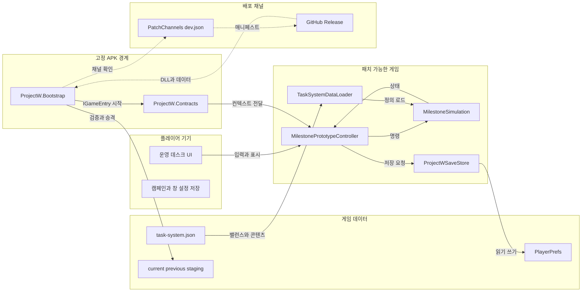
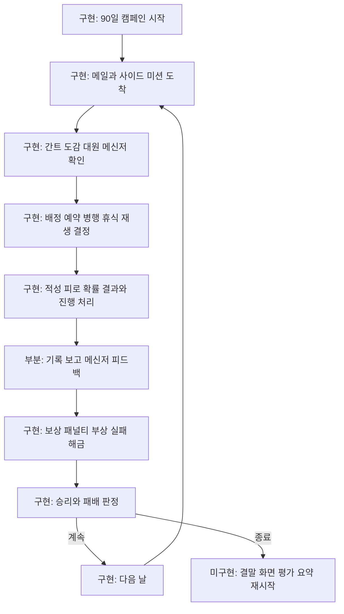
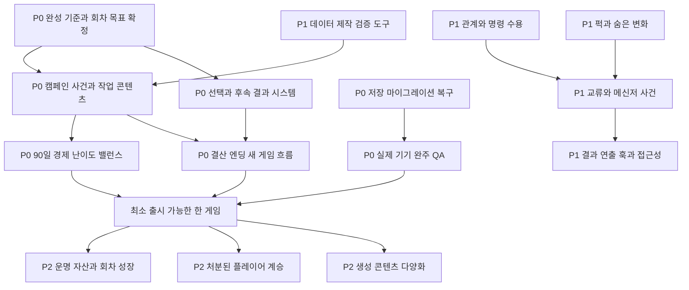

# ProjectW 게임 완성 구조도

## 문서 목적

이 문서는 2026-08-03 `ai-integration` 브랜치의 코드, `task-system.json`,
`Assets/Specification/System/TaskSystem.md`, `IDEA.md`를 기준으로 다음을 구분한다.

- 현재 실제로 플레이 가능한 것
- 시스템은 있으나 게임 경험으로는 덜 완성된 것
- 아트 리소스를 제외하고 하나의 온전한 게임이 되기 위해 필요한 것

여기서 **온전한 하나의 게임**은 시작, 학습, 반복 의사결정, 결과 피드백, 캠페인 결말,
재시작까지 외부 설명 없이 이어지고, 한 회차가 의도한 플레이 시간 동안 의미 있는 선택을
제공하며, 저장과 배포를 포함해 실제 기기에서 안정적으로 끝까지 실행되는 상태를 뜻한다.

비주얼, 일러스트, 애니메이션, 음원 제작은 범위에서 제외한다. 다만 해당 리소스를 나중에
연결할 슬롯과 연출 트리거 같은 엔지니어링 작업은 남은 작업에 포함한다.

## 현재 런타임 구조

현재 APK 경계는 base version 7이다. 게임 규칙과 IMGUI 화면은
`ProjectW.HotUpdate`에서 패치할 수 있지만, Unity 및 패키지 API의 새 AOT 표면, 네이티브 기능,
패키지 변경은 새 base APK가 필요하다. Addressables 원격 콘텐츠 배포는 아직 없다.

## 현재 플레이 루프와 완성도

### 구현됨

- Work와 Task 계층, 선행 관계, 공개일과 메일 수락 게이트
- 소프트 및 하드 마감, 보상과 자원 패널티, 필수 작업 기반 승패
- 주 작업, 소형 병행 작업, 담당자 변경, 중단과 재개, 인수인계 비용
- 시작일 예약, 예상 일정, 학습 자동 배정, 적성 자동 배정
- 여섯 적성, 작업별 요구 적성, 피로, 휴식, 부상, 재생
- 컨디션 기반 저성과, 보통, 대성과와 사고 판정
- 구조화된 무작위 사이드 미션, 다음 날 제안 메일, 실패 직후 재보충
- 읽지 않은 메일 우선 정렬과 메일 효과 적용
- 대원 프로필, 신뢰 표시, 데이터 정의 성격, 성격별 메신저 말투
- 작업 기록과 메신저 대화의 날짜순 통합 표시
- 임무 단어 해금과 카테고리별 접기 가능한 도감
- 간트, 마일스톤, 보고서, 내정보, 옵션, 시스템 로그 UI
- 창 이동, 크기 조정, 핀치, 터치 스크롤, 화면 배율, 배지
- 캠페인 및 데스크 저장, 일부 구버전 저장 보정
- HybridCLR 패치 다운로드, 크기와 SHA-256 검증, 승격과 롤백
- EditMode 자동 테스트 104개

### 부분 구현

| 영역 | 현재 상태 | 온전해지려면 필요한 것 |
|---|---|---|
| 캠페인 | 90일, 중간평가 시점, 최종 작업 공개와 승패 판정이 있음 | 초반부터 결말까지 이어지는 사건 곡선과 충분한 고정 콘텐츠 |
| 작업 결과 | 확률적 성과, 사고, 기록은 있음 | 결과를 선택과 다음 사건으로 연결하는 후속 효과 및 연출 트리거 |
| 사람 | 적성, 피로, 신뢰, 자존심, 권위, 성격 데이터와 재생 인계 선택이 있음 | 관계 변화, 갈등, 명령 수용, 숨은 변화, 교류 규칙 |
| 퍽 | 초기 퍽을 표시함 | 획득, 장단점 효과, 발견, 저장, 밸런스 |
| 메신저 | 상태와 작업 질문, 성격별 말투가 있음 | 사건 대화, 선택지, 관계 변화, 후속 메시지 |
| 경제 | 단일 자원, 보상 및 패널티, 경력 연동 월 기본급이 있음 | 회차 전체 수입과 지출 곡선, 자원 사용처, 파산 압력 검증 |
| 결말 | 승패 플래그와 상태 문구가 있음 | 결산, 원인 요약, 엔딩 분기, 새 게임 진입 |
| 데이터 | 핵심 작업 2개 Work와 생성형 사이드 미션이 있음 | 제작 가능한 스키마, 콘텐츠 검증, 충분한 사건 및 작업 풀 |
| 저장 | 단일 캠페인과 UI 설정을 보존함 | 명시적 새 게임, 슬롯 또는 이어하기 UX, 버전별 마이그레이션 정책 |
| 배포 | 코드와 manifest 파일 패치 및 롤백이 있음 | 실제 기기 장기 안정성, 릴리스 체크리스트, 콘텐츠 원격 배포 여부 결정 |

## 온전한 게임까지의 의존 구조

## 권장 작업 백로그

### P0: 한 회차가 완결되는 최소 게임

이 단계가 끝나면 아트가 플레이스홀더여도 시작부터 결말까지 하나의 게임으로 평가할 수 있다.

1. **완성 기준 고정**
   - 한 회차의 목표 플레이 시간과 목표 승률을 정한다.
   - 플레이어가 반복해서 판단해야 할 핵심 질문을 2~3개로 고정한다.
   - 승리, 필수 작업 실패, 기간 초과, 전원 부상 등 종료 원인별 기대 경험을 명시한다.
2. **캠페인 콘텐츠 골격 확장**
   - 90일을 초반 학습, 중반 압박, 후반 결산으로 나눈다.
   - 고정 Work, 메일, 사건을 각 구간에 충분히 배치한다.
   - 현재 day 45 중간평가를 실제 평가와 후속 변화로 만든다.
   - day 60 최종 작전 이후 선택과 압박을 추가한다.
3. **선택과 결과의 연결**
   - 메일 수락 외에도 최소 한 종류의 다중 선택 사건을 만든다.
   - 선택이 마감, 자원, 작업, 대원 상태 중 둘 이상에 영향을 주게 한다.
   - 즉시 결과와 지연 결과가 기록 및 메신저에서 다시 보이게 한다.
4. **엔딩과 재시작**
   - 종료 입력 잠금, 회차 결산, 주요 선택과 실패 원인 요약을 구현한다.
   - 승리와 패배의 최소 분기를 정의한다.
   - 저장 삭제를 옵션의 위험 기능이 아니라 명확한 새 게임 흐름으로 제공한다.
5. **밸런스 패스**
   - 고정 시드 자동 시뮬레이션과 사람 플레이 로그로 90일 경제를 검증한다.
   - 작업량, 마감, 피로, 사고율, 사이드 미션 보상을 조정한다.
   - 무작위 생성만으로 빈 구간이나 회복 불가능한 상태가 생기지 않게 한다.
6. **저장과 실패 복구**
   - 데이터 및 스냅샷 schema version 변경 규칙을 문서화한다.
   - 패치 전후 저장 호환, 손상 저장, 캠페인 종료 저장을 테스트한다.
   - 초기화와 새 게임에 확인 단계를 둔다.
7. **실제 기기 완주 QA**
   - base APK v7에서 새 설치, 이어하기, 패치, 오프라인 fallback, rollback을 검증한다.
   - 지원 화면비와 최대 배율에서 모든 창의 조작 및 가독성을 확인한다.
   - 한 회차 장기 플레이 중 메모리, 저장 크기, 로그 증가를 확인한다.

### P1: ProjectW만의 사람 운영 게임

P0 이후 이 단계가 게임의 개성을 만든다.

- 신뢰, 자존심, 권위, 플레이어 역량을 실제 명령 수용 판정에 연결
- 거부, 마지못한 수행, 자율 변경, 불만 전파와 그 후속 사건 구현
- 작업 결과에 따른 퍽 획득과 장점 및 단점 효과 구현
- 숨은 변화와 `?` 상태, 티타임이나 회식 같은 발견 행동 구현
- 성격을 단순 문장 접두 및 접미가 아니라 선택 성향과 반응 규칙에 연결
- 메신저 선택지, 사건 대화, 관계 변화와 시간 비용 구현
- 결과 발생과 UI 피드백 사이에 공통 연출 이벤트 인터페이스 추가
- JSON 데이터 ID 중복, 참조 무결성, 도달 불가능 작업, 밸런스 범위를 검증하는 제작 도구 추가

### P2: 반복 플레이와 장기 확장

다음은 `IDEA.md`에 있는 유효한 확장 방향이지만 첫 번째 온전한 회차의 선행 조건은 아니다.

- 처분된 플레이어를 다음 회차 작업자 후보로 보존
- 로르샤흐형 시작 선택과 초기 빌드 생성
- 운명 자산, 초기 보정, 퍽 계승, 사건 재추첨
- 독립 회차 원칙을 지키는 메타 진행
- 생성형 임무의 단어, 구조, 후속 사건, 보상 패턴 다양화

## 구현 순서 제안

가장 먼저 **P0-1 완성 기준**과 **P0-2 캠페인 콘텐츠 표**를 함께 확정하는 편이 좋다.
현재 엔진은 작업을 처리할 수 있지만, 어떤 압박과 선택을 얼마나 자주 제공해야 하는지가
정해지지 않으면 사람 시스템이나 메타 시스템을 먼저 만들어도 완성도를 측정하기 어렵다.

권장 수직 슬라이스는 다음과 같다.

1. day 1~15 고정 사건과 작업을 늘린다.
2. 선택 하나가 작업 일정, 자원, 대원 반응에 동시에 영향을 주게 한다.
3. 그 결과가 보고서와 메신저에 나타나게 한다.
4. 조기 성공 또는 실패 결산 화면까지 연결한다.
5. 이 짧은 회차를 실제 기기에서 반복해 재미와 정보 가독성을 검증한다.
6. 검증된 구조를 90일 전체로 확장한다.

## 완료 판정 체크리스트

- [ ] 신규 플레이어가 외부 도움말 없이 첫날의 의미 있는 결정을 내릴 수 있다.
- [ ] 90일 동안 고정 콘텐츠와 생성 콘텐츠가 의도한 밀도로 공급된다.
- [ ] 선택의 즉시 결과와 지연 결과를 플레이어가 추적할 수 있다.
- [ ] 승리와 모든 패배 원인이 결산 화면에서 설명된다.
- [ ] 결산 후 새 게임을 정상적으로 시작할 수 있다.
- [ ] 대표 시드와 실제 플레이에서 회복 불가능한 밸런스 함정이 통제된다.
- [ ] 저장이 패치 전후와 앱 재시작 후 유지되고 손상 시 안전하게 복구된다.
- [ ] base APK v7 실제 기기에서 한 회차 완주 스모크 테스트를 통과한다.
- [ ] 공개 패치의 크기와 SHA-256, 채널 포인터, rollback이 검증된다.
- [ ] 아트 리소스가 없어도 모든 상태와 선택 결과가 텍스트 및 플레이스홀더로 판독 가능하다.

## 범위 밖 또는 별도 결정이 필요한 항목

- 비주얼, 일러스트, 애니메이션, 음원 자체의 제작
- Addressables 원격 콘텐츠 배포 도입 여부
- 상용 출시 플랫폼, 과금, 계정, 클라우드 저장, 업적
- 현 README가 언급하지만 현재 브랜치에 존재하지 않는 과거 `CaseReviewGame`,
  `RoutineObservationMvpSession` 계열을 복구할지, 현재 MilestonePrototype으로 완전히 대체할지의 결정
